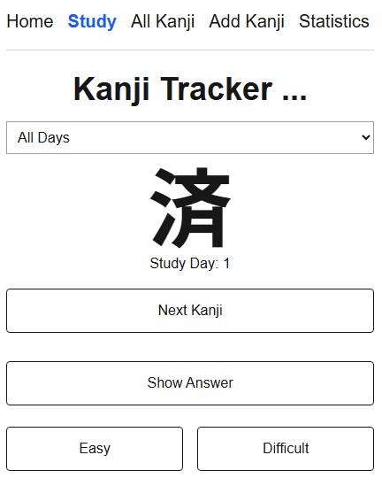
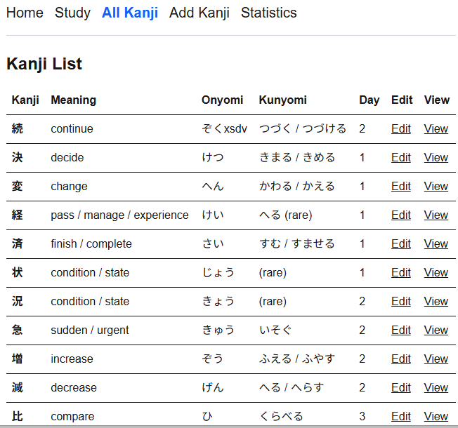
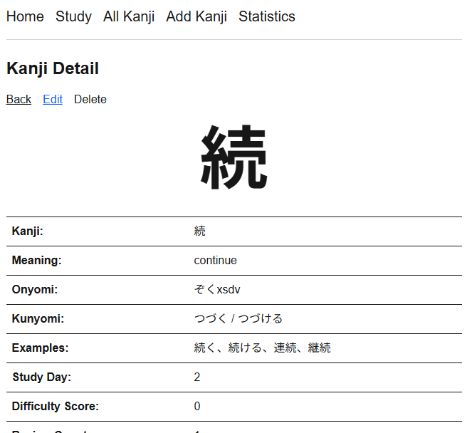
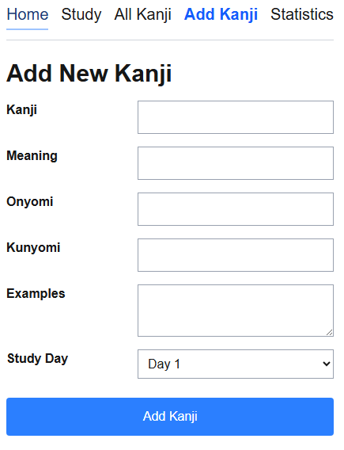

# Kanji Study Tracker

A personal Japanese kanji study application built with Next.js, React, TypeScript, and Supabase.

This project began as a way to learn modern full-stack web development and has gradually evolved into a practical study tool that I use while preparing for the JLPT.

---

## Project Goals

The application allows me to:

- Store personal kanji study notes
- Organize kanji by study day
- Review kanji using flashcard-style practice
- Track review history
- Prioritize difficult kanji during study sessions

At the same time, the project serves as a hands-on way to learn React, TypeScript, Next.js, and software design principles.

---

## Current Features （現在の機能）

### Kanji Management （漢字データベース）

- Add new kanji
- View all stored kanji
- Store:
  - Kanji
  - Meaning
  - Onyomi
  - Kunyomi
  - Example words
  - Study day

### Study Mode（学習モード）

- Filter by study day
- Study all days together
- Random kanji selection
- Prevent immediate duplicate cards
- Show / Hide answers
- Next card navigation

### Smart Review（スマート復習）

Each kanji stores:

- Review count
- Difficulty score

After every review you can mark a card as:

- Easy
- Difficult

The application updates the review statistics automatically.

Kanji with higher difficulty scores appear more frequently using a weighted random selection algorithm, allowing weaker cards to be reviewed more often while still showing easier cards occasionally.

---

## Tech Stack（使用技術）

- Next.js
- React
- TypeScript
- Supabase
- PostgreSQL
- Tailwind CSS is used throughout the project to build a mobile-first responsive interface without maintaining separate CSS files.
- Vercel
- Git & GitHub

---

## Architecture

The application follows a modular App Router structure.

Features include:

- Multi-page Next.js App Router
- Reusable React components
- Service layer for database operations
- Mobile-first responsive design
- Shared TypeScript models
- Separation of UI and business logic

Reusable components currently include:

- Navigation
- KanjiForm
- DeleteModal
- Toast

## Project Status（開発状況）

### Completed

- ✅ Supabase integration
- ✅ Database design
- ✅ Create (CRUD)
- ✅ Read (CRUD)
- ✅ Random study mode
- ✅ Study day filtering
- ✅ Flashcard interface
- ✅ Easy / Difficult review system
- ✅ Review statistics
- ✅ Weighted review algorithm
- ✅ Vercel deployment
- ✅ Update (CRUD)
- ✅ Delete (CRUD)
- ✅ Reusable form component
- ✅ Service layer architecture
- ✅ Custom confirmation dialog
- ✅ Toast notifications
- ✅ Responsive navigation

### In Progress

- Dashboard page
- Study Day management
- Review algorithm cleanup and optimization

### Planned

- User authentication
- Personal kanji collections
- User-specific progress
- Study statistics dashboard
- Smarter spaced repetition scheduling

---

## Running Locally（ローカルでの実行）

Install dependencies:

```bash
npm install
```

Start the development server:

```bash
npm run dev
```

Open:

```
http://localhost:3000
```

---

## Environment Variables（環境変数）

Create a `.env.local` file:

```env
NEXT_PUBLIC_SUPABASE_URL=your_supabase_url
NEXT_PUBLIC_SUPABASE_ANON_KEY=your_supabase_anon_key
```

Do not commit `.env.local` to GitHub.

---

## Screenshots

### Study Mode



### Kanji List



### Kanji Detail



### New Kanji



---

## Design Philosophy

This application is intentionally built using a mobile-first approach.

The interface favors simplicity over feature density, making it comfortable to use on both phones and desktops. Desktop layouts expand naturally from the mobile design rather than becoming entirely separate interfaces.

As the project grows, reusable React components and a dedicated service layer help keep the codebase modular, maintainable, and easy to extend.

---

## What I've Learned（学んだこと）

This project has been my practical introduction to modern full-stack development. Along the way I've learned about:

- React state management
- TypeScript
- Next.js App Router
- Supabase CRUD operations
- PostgreSQL
- Reusable component architecture
- JavaScript algorithms
- Software refactoring
- Git and GitHub workflows
- Deploying applications with Vercel
- Service layer architecture
- Responsive UI design
- Tailwind CSS

## Development Journal（開発ログ）

See PROJECT_LOG.md for a chronological record of features, design decisions, lessons learned, and reflections.

---

## About

Built as a personal learning project and Japanese kanji study tool.
